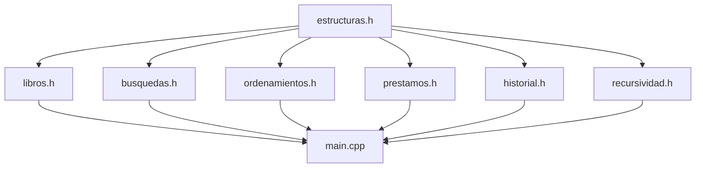

# 🏛️ Especificación de Arquitectura de Software

Este documento detalla el diseño de modularización, acoplamiento y flujo de compilación del **Sistema de Gestión de Biblioteca Universitaria**.

---

## 📦 1. Acoplamiento y Flujo de Dependencias

Para evitar la duplicación de tipos y problemas de declaración cíclica, la arquitectura sigue una estructura de capas limpia:

### Regla de Oro del Acoplamiento:
*   **[estructuras.h](../estructuras.h)**: Contiene únicamente definiciones de structs (`Libro`, `Prestamo`, `Operacion`) y de nodos. **No contiene funciones**.
*   **Archivos de Cabecera (.h)**: Contienen únicamente prototipos de funciones y directivas `#ifndef`. **No contienen implementaciones de código ejecutable**.
*   **Archivos de Fuente (.cpp)**: Contienen el desarrollo de las funciones declaradas.

---

## ⚙️ 2. Lógica del Menú e Historial de Deshacer (Undo)

El punto central del sistema se encuentra en **`main.cpp`**, que actúa como orquestador. Cuando se realiza una operación destructiva o modificadora en el catálogo, se genera un objeto de tipo `Operacion` y se realiza un `push` a la pila global `historialCima`:

1.  **Registrar Libro**: Si Víctor registra un libro, se guarda su estado en la pila. Si se presiona **Deshacer**, se llama a `eliminarLibro` usando el código de barra/libro registrado.
2.  **Eliminar Libro**: Si Víctor borra un libro, los datos completos del libro se guardan de respaldo en `Operacion.libroOriginal`. Al presionar **Deshacer**, Wilmer llama a `registrarLibro` pasando el struct de respaldo, restaurándolo en la lista doble.
3.  **Realizar Préstamo**: Al conceder un préstamo, se disminuye el stock del libro y se guarda la operación en la pila. Al presionar **Deshacer**, el sistema busca el libro por código e incrementa su cantidad disponible.
