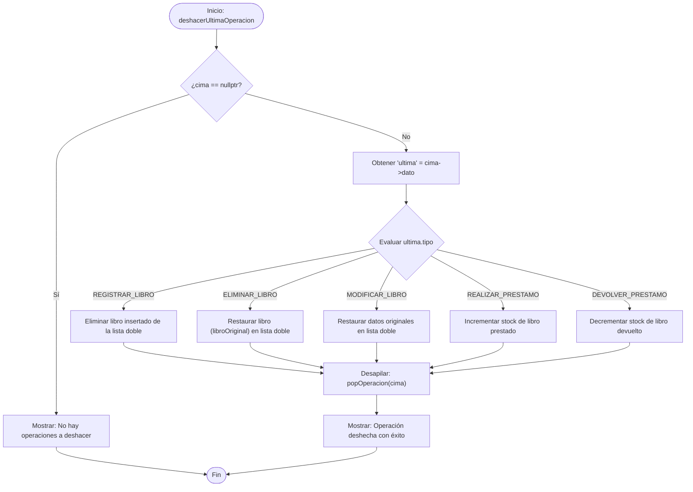
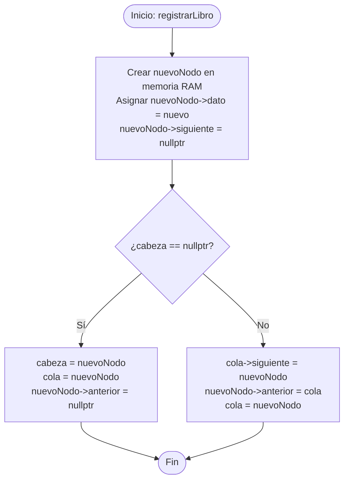

# 📊 Diagramas de Flujo del Sistema

Este documento contiene los diagramas de flujo que describen de forma lógica el funcionamiento de las operaciones avanzadas del sistema de biblioteca.

---

## 1. Algoritmo de Deshacer (Undo) - Módulo 5 (Wilmer)
Describe cómo el sistema evalúa la pila de historial de operaciones para revertir el último cambio de forma segura.

---

## 2. Inserción al Final en Lista Doblemente Enlazada - Módulo 1 (Víctor)
Describe el algoritmo para insertar un libro al final del catálogo y enlazar correctamente los punteros dobles.

