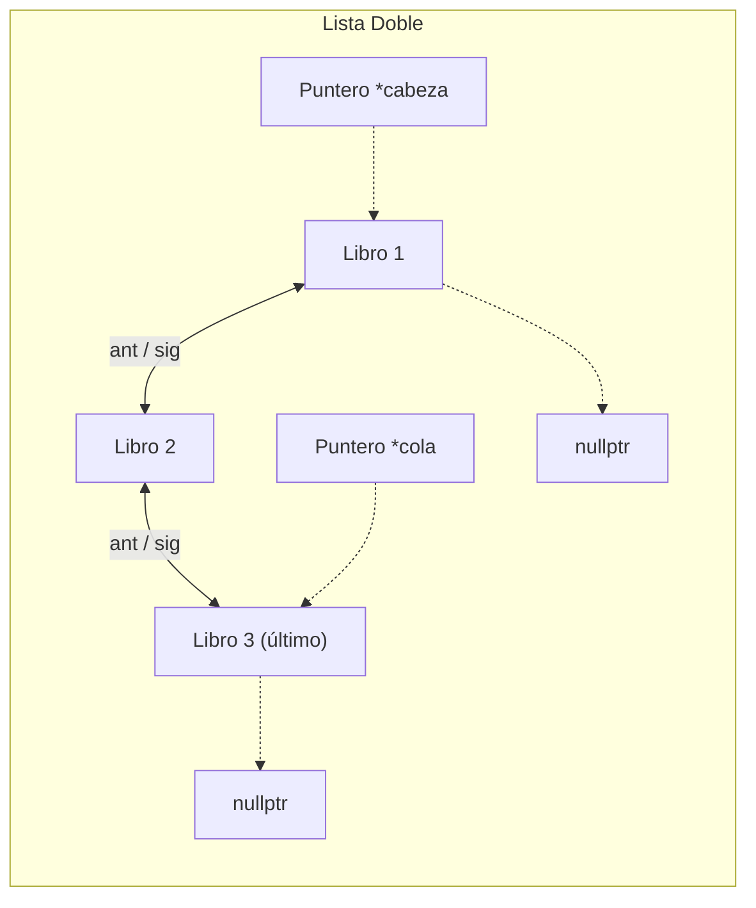
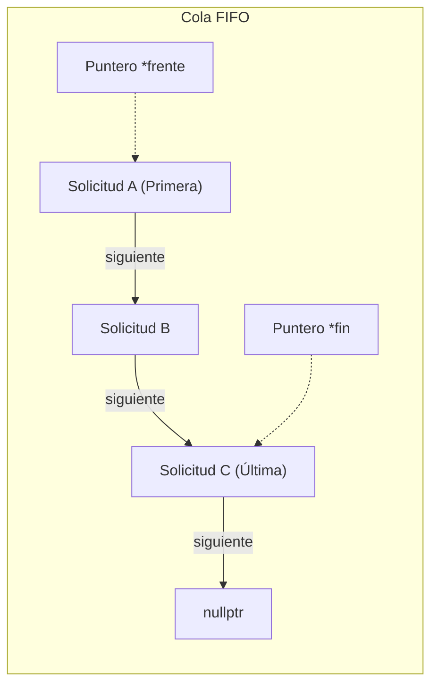
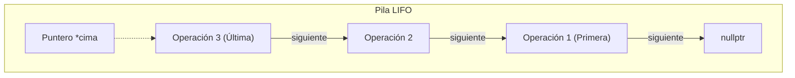

# 🔗 Diagramas de Nodos del Sistema

Este documento describe la estructura y los enlaces en memoria dinámica (RAM) de las estructuras de datos personalizadas del sistema de biblioteca.

---

## 1. Módulo 1: Lista Doblemente Enlazada (Catálogo de Libros)
Los nodos están conectados bidireccionalmente. Cada nodo posee un puntero al nodo posterior (`siguiente`) y al nodo anterior (`anterior`). La lista cuenta con una `cabeza` y una `cola`.

---

## 2. Módulo 4: Cola FIFO (Fila de Solicitudes)
La cola es una estructura lineal en la cual los elementos nuevos ingresan por un extremo (`fin`) y se atienden/retiran por el otro (`frente`).

---

## 3. Módulo 5: Pila LIFO (Historial de Operaciones)
Las operaciones del historial se apilan de manera que la última acción registrada queda al tope. Al realizar un "deshacer" (Undo), la operación del tope (`cima`) es la primera en desapilarse y ejecutarse.

