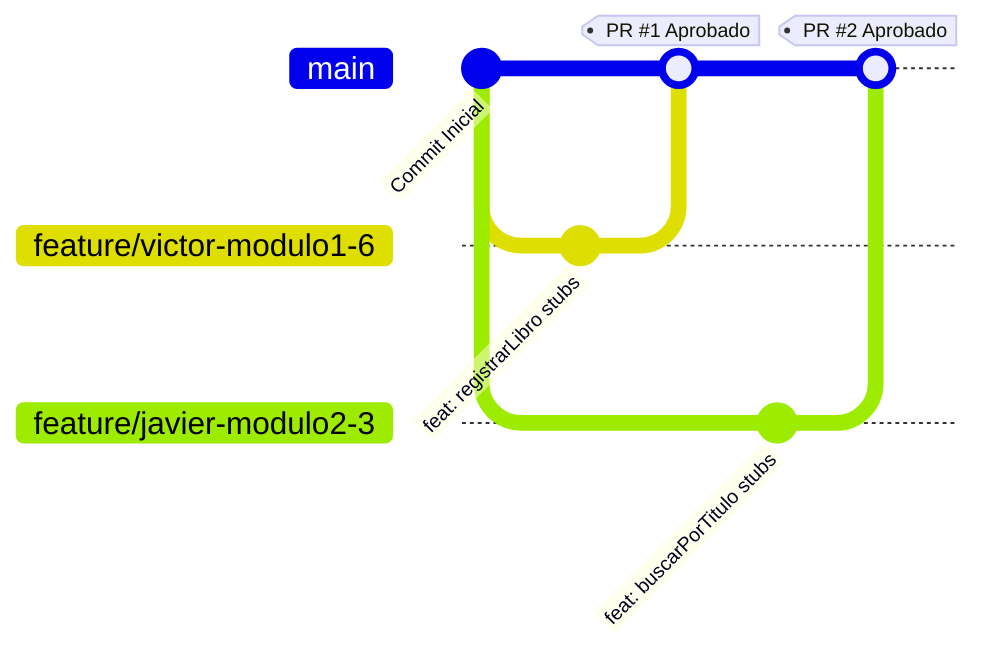

# 🐙 Guía de Colaboración y Flujo de Trabajo en Git

Esta guía establece el flujo de trabajo oficial para el desarrollo colaborativo del **Sistema de Gestión de Biblioteca Universitaria**. Define los pasos que Javier, Víctor y Wilmer deben seguir para coordinar su código de forma segura en el repositorio compartido.

---

## 💡 Modelo de Colaboración: Repositorio Compartido

> [!IMPORTANT]
> **Modelo de Trabajo: Clonación Directa (Sin Fork)**
> Al ser todos colaboradores directos con acceso de escritura, **no se realiza Fork**. Cada integrante clona el repositorio original, trabaja en su propia rama (`feature/`) y sube sus cambios directamente al mismo servidor para revisión.

---

## 🎨 Flujo de Trabajo en Ramas



---

## 🚀 Paso a Paso del Flujo de Trabajo

### Paso 1: Configuración Inicial (Solo una vez)
Clona el repositorio e ingresa al directorio de trabajo local:
```bash
# 1. Clona el repositorio oficial desde GitHub
git clone https://github.com/wigsdev/gestion_biblioteca_universitaria.git

# 2. Entra a la carpeta del proyecto de biblioteca en tu sistema local
cd <RUTA_LOCAL_DEL_PROYECTO>/gestion_biblioteca_universitaria
```

### Paso 2: Sincronizar y Crear Rama de Trabajo
Antes de programar, descarga lo último del equipo y crea una rama independiente:
```bash
# 1. Asegúrate de estar en la rama principal
git checkout main

# 2. Descarga los últimos cambios del servidor
git pull origin main

# 3. Crea y cámbiate a tu rama de desarrollo
git checkout -b <nombre_rama>
```
> [!TIP]
> **Nomenclatura oficial de ramas:**
> *   Javier: `feature/javier-modulo2-3`
> *   Víctor: `feature/victor-modulo1-6`
> *   Wilmer: `feature/wilmer-modulo4-5`

### Paso 3: Guardar Cambios Locales (Commits)
A medida que completes partes de tu código o documentación, realiza commits con la convención estándar (ver [Reglas de Commits](reglas_implementacion_commits.md)):
```bash
# 1. Prepara tus archivos para registrar
git add <archivo_modificado>

# 2. Confirma con un mensaje estructurado
git commit -m "<tipo>(<alcance>): <descripcion_corta>"
```
*Ejemplo:* `git commit -m "feat(libros): implementar busqueda recursiva"`

### Paso 4: Subir la Rama a GitHub
Una vez que el código compile localmente de forma limpia con `mingw32-make`, sube tus cambios:
```bash
git push origin <nombre_rama>
```

### Paso 5: Crear el Pull Request (PR) en GitHub
1. Ve a la página del repositorio en GitHub.
2. Haz clic en **"Compare & pull request"** en la notificación amarilla.
3. Asigna a tus compañeros como revisores (**Reviewers**).
4. Espera a que al menos un integrante revise y apruebe (`Approve`) tus cambios antes de fusionar.

### Paso 6: Sincronización Post-Fusión
Una vez integrado tu PR a `main` en GitHub, limpia tu espacio de trabajo local:
```bash
# 1. Regresa a la rama principal local
git checkout main

# 2. Descarga la versión integrada con tus cambios y los de tus compañeros
git pull origin main

# 3. Elimina tu rama de desarrollo local
git branch -d <nombre_rama>
```

---

## ⚡ Resolución de Conflictos

Si Git bloquea la fusión automática por modificaciones en las mismas líneas:

1. **Combina los cambios de main en tu rama local:**
   ```bash
   git checkout <nombre_rama>
   git fetch origin
   git merge origin/main
   ```
2. **Resuelve en tu editor (VS Code):**
   Limpia las marcas de conflicto seleccionando la versión correcta del código:
   ```cpp
   <<<<<<< HEAD
   // Tus cambios locales
   =======
   // Cambios traídos desde main
   >>>>>>> origin/main
   ```
3. **Guarda y sube la resolución:**
   ```bash
   git add <archivo_resuelto>
   git commit -m "merge: resolver conflictos en <archivo>"
   git push origin <nombre_rama>
   ```
